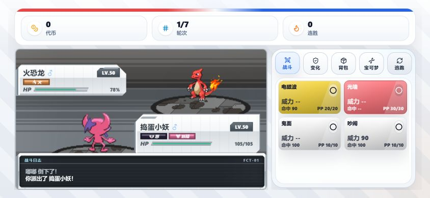
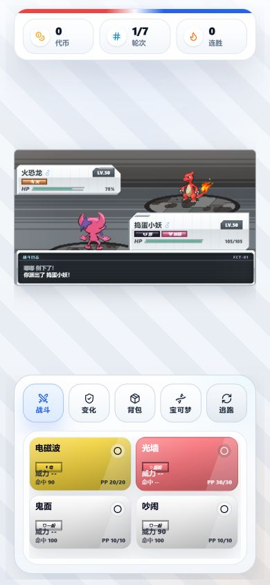
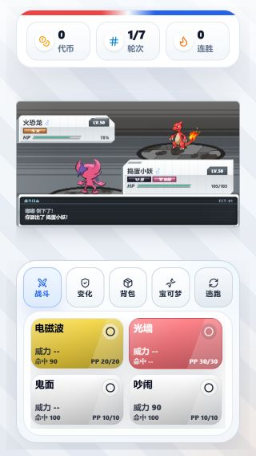

# 手机横屏战斗运行验收

2026-09-26，在 Codex 侧边浏览器以 `http://localhost:4300/` 的独立来源打开正在运行的游戏，进入真实第 1 场战斗并完成换人、出招等操作。截图来自该游戏实例，不是构造页面；截屏只用于保存运行证据。未清除 `http://127.0.0.1:4300/` 的既有存档。视口数据为页面布局稳定后的 `getBoundingClientRect()` 实测值。

| 视口 | 场地 | 主命令按钮 | 四个招式 | 文档溢出 |
| --- | --- | --- | --- | --- |
| 844×390 | 约 495×278（改前约 206×116） | 高 44，宽约 49 | 两列、四个直接可见 | 无 |
| 390×844 | 350×197 | 高 56，宽约 59 | 两列、四个直接可见 | 无 |
| 320×568 | 280×158 | 高 50，宽约 48 | 两列、四个直接可见 | 无 |

844×390 截图：

390×844 截图：

320×568 截图：

在 844×390 实战中，“变化”显示状态面板，“背包”显示空背包，“宝可梦”列表可纵向滚动；原双列卡片在窄右侧面板被裁切，已改为单列。先主动换上嘟嘟，后在嘟嘟倒下时再次换回捣蛋小妖，均成功。点击“三重攻击”后，敌方 HP 从 100% 降到 78%，PP 从 10/10 变为 9/10，证明右侧招式命中区域可用。五个主命令均直接显示；本轮未二次确认“逃跑”，其余四个已实际打开或返回。四个招式均显示，其中一招实际发动。战斗日志固定展示最新两条，没有展开入口，因此计划中的“展开日志”无法执行，需另行定义需求。

全量刷新后未再出现白屏；钱包改动进行中的热更新曾产生 Hook 顺序异常和一次临时白屏，属于并行编辑过程，不计为最终运行结果。`npm run lint` 与 `npm run build` 均通过。实体手机的浏览器地址栏伸缩、旋转和手指误触尚未验证。
