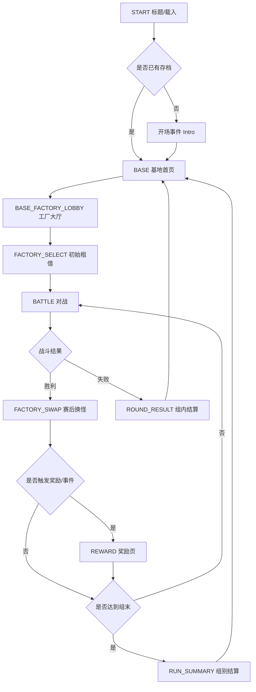
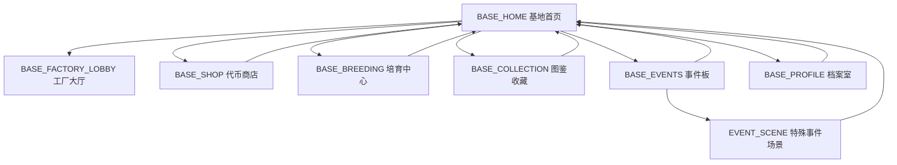

# 宝可梦对战工厂 项目设计框架 v1

> 项目路径：`D:\Games\pokeFactory2`  
> 整理日期：2026-04-04  
> 目标：在当前原型基础上，确立“对战工厂局内挑战 + 局外培育收集成长”的完整产品框架，作为后续共创和开发基线。

## 1. 项目定位

### 1.1 一句话定义

这是一款以“对战工厂”连胜挑战为核心、以“代币驱动的局外培育与收集”为长期目标的宝可梦单机养成对战游戏。

### 1.2 核心幻想

- 玩家不是传统道馆巡礼训练家，而是“被卷入对战工厂试炼”的挑战者。
- 局内依靠临时租借与现场决策求生。
- 局外依靠代币、培育、图鉴和事件逐步建立自己的长期资产。
- 玩家每次进入工厂都像一次新的试炼，但每次失败都能为下一次挑战留下价值。

### 1.3 产品支柱

- `支柱一：高复玩性`
  - 核心体验是 3v3 工厂挑战，单局时长清晰，适合反复开跑。
- `支柱二：失败也有成长`
  - 即使挑战中断，玩家仍能获得代币、图鉴记录、事件进度或培育推进。
- `支柱三：局内公平，局外长期`
  - 局内仍以租借池与换怪策略为主，局外成长提供的是中长期目标与少量结构性加成，不直接碾压工厂对局。
- `支柱四：事件驱动世界感`
  - 随着存档推进，基地、NPC、特殊来客、传说事件逐步解锁，让工厂不只是“刷关房间”。

## 2. 玩家体验总循环

### 2.1 单局循环

`起始遭遇 -> 被带入工厂 -> 初始租借 -> 3v3 连战 -> 赛后换怪/奖励 -> 7 战一组结算 -> 继续更高组别或失败退出`

### 2.2 长线循环

`完成挑战 -> 获得代币/图鉴/事件进度 -> 回到基地 -> 培育/孵化/商店消费/查看事件 -> 解锁新功能 -> 再次进入工厂`

### 2.3 核心情绪节奏

- 开局是“未知与被卷入”。
- 中段是“租借决策与险胜翻盘”。
- 组末是“首领压力与阶段结算”。
- 局外是“恢复、整理、投资、期待下一次回归”。

## 3. 世界观与开场框架

### 3.1 开场设定

- 玩家以普通训练家身份进入某处设施区域。
- 在初始事件中偶遇一只宝可梦，这只宝可梦会成为“命运引子”。
- 玩家随后被工厂系统识别为适格挑战者，进入对战工厂。
- 这一只“初遇宝可梦”不直接进入工厂租借队，但会成为局外长期线的重要锚点。

### 3.2 初遇宝可梦的设计价值

- 是剧情入口，不是传统御三家选择。
- 可作为“个人档案宝可梦”长期存在于局外基地。
- 随存档进度可开启专属事件、特殊形态、纪念称号或限定培育分支。

### 3.3 世界结构建议

- `对战工厂大厅`
  - 进入挑战、查看连胜、接受每日挑战。
- `基地休息区`
  - 局外总入口，承接商店、培育、图鉴、事件。
- `培育中心`
  - 存放培育中的宝可梦、蛋队列、继承规则。
- `收藏终端`
  - 图鉴、形态册、成就册、特殊记录。
- `事件区域`
  - 依据进度刷出 NPC、来访训练家、支线挑战。

## 4. 局内设计框架

### 4.1 玩法核心

- 局内采用工厂租借制，不让玩家直接带入局外养成队伍。
- 玩家比拼的是识别强度、临场换怪、资源判断与赛后替换决策。
- 每 7 场为一组，第 7 场为首领战或特殊战。

### 4.2 标准局内流程

1. 开局展示 6 只租借候选。
2. 玩家选 3 只组成初始队伍。
3. 进入 3v3 对战。
4. 战后进入赛后节点。
5. 赛后节点可能包含换怪、奖励、事件插入。
6. 完成 7 战后结算组别奖励。
7. 玩家选择继续挑战或返回基地。

### 4.3 建议保留的工厂核心规则

- 同组内强调“交换价值”。
- 对手和租借池都有质量分层。
- 对手 AI 随组别提升。
- 第 7 战提供明确难度跃升和额外奖励。

### 4.4 建议收敛的规则

- `Classic Factory` 中禁用捕捉。
- 商店不进入经典工厂主循环。
- 局内成长尽量只体现为短期战术收益，而不是永久属性滚雪球。

### 4.5 推荐的双模式结构

- `经典工厂模式`
  - 租借、对战、赛后换怪、7 战一组、纯粹连胜。
- `Rogue 工厂模式`
  - 保留奖励卡、局内商店、战斗特殊机制、更多随机事件。

> 建议版本策略：先把 `经典骨架 + 局外循环` 做稳，再把当前已有的奖励页内容整理为 `Rogue 模式`。

## 5. 局外设计框架

### 5.1 局外目标

- 为玩家提供长期目标，降低“每局都归零”的空虚感。
- 增加收集、培育、事件和功能解锁，构建留存动力。
- 保证局外成长不直接破坏工厂对战的公平认知。

### 5.2 局外主模块

- `基地主界面`
  - 展示代币、当前解锁、事件提示、最近 run 结果。
- `代币商店`
  - 消耗代币购买解锁项、便利功能、培育道具、外观收藏。
- `培育中心`
  - 两只宝可梦入驻、相容度、产蛋、孵化推进。
- `图鉴与收藏`
  - Seen、Owned、Forms、特殊形态记录。
- `事件板`
  - 随存档进度开放特殊 NPC 与剧情片段。

### 5.3 局外成长的边界

- 可以提升“可选项”和“便利度”。
- 不建议直接给局内永久数值加成。
- 更推荐以下加成方向：
  - 初始租借信息更完整。
  - 每组一次免费重抽。
  - 赛后恢复更稳定。
  - 解锁新的事件池和特殊挑战。
  - 扩展图鉴、培育、外观和称号系统。

## 6. 代币经济框架

### 6.1 代币定位

- 代币是整个游戏的主长期货币。
- 主要来源是工厂挑战。
- 主要用途是局外解锁和培育消费。

### 6.2 代币产出建议

- `对战胜利`
  - 每胜给予基础代币。
- `组别完成`
  - 每完成 7 战追加阶段奖励。
- `首领击破`
  - 第 7 战附加奖励。
- `失败保底`
  - 即使失败也给少量代币，避免挫败感。
- `图鉴奖励`
  - 首次记录、形态收集里程碑给一次性奖励。
- `事件奖励`
  - 特殊 NPC 或支线挑战结算代币。

### 6.3 代币消耗分层

- `低价常购`
  - 孵化加速、培育消耗品、信息型增益。
- `中价成长`
  - 新功能槽位、特殊事件钥匙、局外设施升级。
- `高价收藏`
  - 稀有外观、称号、纪念摆设、特殊图鉴页。

### 6.4 推荐保留的经济原则

- 余额上限。
- 生涯累计代币单独统计。
- 所有加减走统一 API。
- 组别越高，奖励递增但增长要钳制。

## 7. 培育系统框架

### 7.1 培育的产品目标

- 为玩家提供非战斗型长期养成目标。
- 把遭遇、收集、图鉴、事件串成闭环。
- 作为“宝可梦情感关系”的沉淀系统。

### 7.2 培育 v1 建议

- 双槽位培育。
- 显示相容度。
- 通过挑战次数或局外时间推进产蛋。
- 蛋孵化后进入“收藏池”而非直接进入工厂战斗队伍。

### 7.3 培育产出的用途

- 解锁图鉴条目。
- 触发后代专属事件。
- 提供基地展示与收藏价值。
- 作为少量局外任务需求。

### 7.4 为什么不直接让培育产物进入工厂

- 工厂的魅力在于临时租借与逆境决策。
- 如果可直接带入高练度成品，会稀释工厂识别度。
- 更合理的方案是让培育影响局外目标、事件和轻度规则修正。

## 8. 图鉴与收集框架

### 8.1 记录层级

- `Seen`
  - 在工厂或事件中见过。
- `Owned`
  - 在收藏池、培育成果或特殊事件中正式持有过。
- `Forms`
  - 记录特殊形态、地区形态、Mega、极巨、太晶等。

### 8.2 收集来源

- 工厂中首次遭遇记录。
- 培育产出。
- 事件赠予。
- 特殊首领战解锁。

### 8.3 收集奖励

- 图鉴阶段代币。
- 事件触发权限。
- 收藏展示位。
- 特殊背景、称号、基地装饰。

## 9. 特殊事件框架

### 9.1 事件触发原则

- 事件不是纯随机，而是与存档进度绑定。
- 事件应奖励“内容访问权”，而不只是一次性资源。
- 事件要服务于世界感、收集感和长期目标。

### 9.2 建议的事件解锁维度

- 总挑战次数。
- 总连胜纪录。
- 完成组别数。
- 图鉴 Seen 数量。
- 拥有的培育成果数量。
- 初遇宝可梦亲密度或陪伴进度。

### 9.3 事件类型池

- `基地来客事件`
  - 某位训练家来访，开启新挑战或新商店页。
- `初遇宝可梦事件`
  - 与开场宝可梦相关的小剧情、特殊奖励或形态线。
- `工厂异变事件`
  - 某个组别被特殊规则覆盖，例如天气赛、属性限定赛。
- `收藏事件`
  - 图鉴达到节点后开启稀有遭遇。
- `培育事件`
  - 特定组合产蛋后触发研究员剧情。

### 9.4 可落地的首批特殊事件

- 完成首个 7 连胜后，解锁“基地休息区”。
- 累计 3 次挑战后，解锁“培育中心”。
- Seen 达到 30 后，解锁“收藏终端”。
- 完成第 3 组首领战后，解锁“特殊战斗模式”。
- 初遇宝可梦陪伴度达到阈值后，触发专属剧情。

## 10. 推荐补充内容

### 10.1 每日挑战

- 每天固定随机种子。
- 所有玩家面对同一租借池与同一首领规则。
- 用于排行榜、分享与直播传播。

### 10.2 工厂研究任务

- 类似赛季任务或周常。
- 例子：
  - 用 3 只不同属性完成一组。
  - 一组内不交换超过 1 次。
  - 用异常状态击败 5 只敌方宝可梦。

### 10.3 对手风格提示

- 在战前给出“对手偏向高速 / 耐久 / 天气 / 物攻”等信息。
- 既保留决策乐趣，也减少纯盲猜。

### 10.4 基地展示

- 把高连胜奖杯、事件纪念物、稀有蛋、特殊形态做成可视化陈列。
- 这样局外就不仅是菜单，而是玩家成果的空间化展示。

### 10.5 初遇宝可梦陪伴系统

- 不直接参战，但持续陪伴在基地。
- 随事件提升亲密度。
- 高亲密度可解锁：
  - 专属对话
  - 特殊背景
  - 稀有事件钥匙
  - 结局分支

## 11. 系统状态与页面框架建议

### 11.1 当前项目已有状态

- `START`
- `FACTORY_SELECT`
- `BATTLE`
- `FACTORY_SWAP`
- `REWARD`
- `ROUND_RESULT`
- `GAMEOVER`

### 11.2 建议新增的中长期状态

- `BASE`
  - 局外基地总入口。
- `SHOP`
  - 代币商店。
- `BREEDING`
  - 培育中心。
- `COLLECTION`
  - 图鉴与收藏。
- `EVENT`
  - 特殊事件场景。
- `RUN_SUMMARY`
  - 一次 run 完整结算。

### 11.3 推荐的新总流程

`START -> 开场事件 -> BASE -> FACTORY_SELECT -> BATTLE -> FACTORY_SWAP/REWARD -> ROUND_RESULT -> BASE`

> 这样设计后，`START` 只负责第一次进入和载入存档，真正的长期游玩中枢应该是 `BASE`。

## 12. 存档数据结构建议

### 12.1 玩家元数据

- `tokens`
- `lifetimeTokens`
- `highestStreak`
- `highestSetCleared`
- `unlockFlags`
- `currentStoryStep`

### 12.2 进行中 run

- `runStatus`
- `mode`
- `stage`
- `setNo`
- `battleIndexInSet`
- `streak`
- `swapCount`
- `rentalTeam`
- `enemyPreviewSeed`

### 12.3 局外成长

- `breedingSlots`
- `eggQueue`
- `hatchProgress`
- `ownedCollection`
- `seenCollection`
- `eventProgress`
- `starterBond`

### 12.4 配置化建议

- 奖励公式配置化。
- 事件触发条件配置化。
- 商店商品表配置化。
- 图鉴阶段奖励配置化。

## 13. 与当前代码的映射建议

### 13.1 现有代码可以继续沿用的部分

- `useFactoryFlow`
  - 继续负责租借、换怪、敌队生成。
- `useBattleController`
  - 继续负责战斗行为与结算。
- `useRewardFlow`
  - 调整为 Rogue 模式或赛后奖励分支。
- `GameView`
  - 作为总状态分发入口。

### 13.2 建议新增的模块

- `useMetaProgression`
  - 管理局外成长、代币、解锁、事件。
- `useSaveData`
  - 管理存档读写、版本迁移、断线恢复。
- `useBaseFlow`
  - 管理基地入口、商店、培育、图鉴跳转。
- `meta/config/*`
  - 维护商店、事件、任务、图鉴奖励等配置。

### 13.3 推荐的实现顺序

1. 先建立 `BASE` 和存档结构。
2. 把结算从“失败后直接回 START”改为“回 BASE”。
3. 将代币经济与局外菜单打通。
4. 再接入培育、图鉴、事件。

## 14. 版本路线图

### 14.1 M1 核心闭环

- 明确模式结构。
- 完成统一结算。
- 加入 `BASE`。
- 打通代币结算与消费。

### 14.2 M2 局外 v1

- 商店页。
- 基础解锁项。
- 本地存档持久化。

### 14.3 M3 培育与图鉴 v1

- 培育双槽。
- 蛋队列。
- 图鉴页面。
- 首批图鉴节点奖励。

### 14.4 M4 事件与特殊模式

- 初遇宝可梦事件线。
- 每日挑战。
- 特殊首领战。
- Classic / Rogue 双模式切换。

## 15. 这份框架下的关键设计结论

- 游戏的真正核心不是“单纯还原 Battle Factory”，而是“以 Battle Factory 为局内主玩法的长期成长游戏”。
- 局内必须保持工厂策略辨识度，局外则负责承接成长与情感。
- 初遇宝可梦应成为贯穿存档的陪伴型内容核心。
- 基地系统是当前原型走向完整产品最关键的一步。
- 经典工厂和 Rogue 工厂可以共存，但开发顺序应先稳经典骨架，再整合已有 Rogue 内容。

## 16. 下一步最值得先细化的 4 个专题

1. `基地 Base 页面结构`
2. `代币商店商品表`
3. `培育系统 v1 规则`
4. `事件解锁树`

---

## 17. Base 基地页面结构

### 17.1 Base 的产品职责

`BASE` 不是单纯菜单页，而是整个游戏的长期中枢，承担以下职责：

- 承接一次 run 结束后的整理与回收。
- 向玩家展示长期成长进度。
- 提供进入下一次工厂挑战前的准备空间。
- 作为商店、培育、图鉴、事件的统一入口。
- 用环境变化体现存档成长与世界推进。

### 17.2 Base 的设计原则

- `一眼知道现在能做什么`
  - 玩家回到基地后，应立即看到可领取、可消费、可解锁、可进入的内容。
- `优先展示新变化`
  - 新事件、新孵化、新商店货品、新图鉴奖励，应被高亮。
- `减少层级跳转成本`
  - 基地尽量作为 Hub，主要功能 1 次点击内进入。
- `兼顾情绪恢复`
  - 局内高压，局外需要更稳定、更舒缓，形成节奏反差。

### 17.3 Base 首页推荐布局

建议拆成 6 个主要区域：

1. `顶部资源条`
2. `中央主舞台`
3. `快捷入口区`
4. `最新动态区`
5. `陪伴宝可梦区`
6. `底部操作区`

### 17.4 页面区域说明

#### A. 顶部资源条

作用：让玩家进入基地的第一秒就看到“我这局拿到了什么、现在能做什么”。

建议展示：

- 当前代币 `tokens`
- 生涯累计代币 `lifetimeTokens`
- 当前最高连胜
- 当前已解锁设施数
- 今日挑战状态

可附加的小提示：

- `新纪录`
- `有可领取奖励`
- `培育已完成`
- `有新事件`

#### B. 中央视觉主舞台

这是基地的“空间感核心”，建议做成一个半场景化主面板，而不是纯按钮墙。

建议主舞台包含：

- 基地背景图或分层场景
- 当前在场的陪伴宝可梦
- 当前最重要的可互动 NPC
- 当前高亮建筑或功能入口

主舞台承担的动态变化：

- 存档推进后，基地外观逐步升级
- 新设施解锁后，场景新增入口
- 特殊事件触发时，中央区域出现事件角色或视觉异变

#### C. 快捷入口区

这是基地最核心的功能导航区，建议常驻 5 个主入口：

- `进入工厂`
- `代币商店`
- `培育中心`
- `图鉴收藏`
- `事件板`

可选扩展入口：

- `研究任务`
- `每日挑战`
- `档案室`

每个入口卡片建议显示：

- 名称
- 一句话功能说明
- 是否有新内容
- 当前进度摘要

示例：

- 培育中心：`1枚蛋可领取`
- 图鉴收藏：`新增 3 条 Seen`
- 事件板：`有 1 个新来客`

#### D. 最新动态区

这是基地首页最重要的“回归理由展示区”，专门告诉玩家现在有哪些变化。

建议按优先级显示：

- 刚刚本局获得的代币与记录
- 新解锁设施
- 新事件触发
- 蛋孵化完成
- 图鉴节点奖励可领取
- 新挑战模式开放

推荐用 3 条以内滚动摘要，避免信息噪音。

#### E. 陪伴宝可梦区

这个区域专门承接“初遇宝可梦”的长期价值。

建议显示：

- 宝可梦立绘
- 当前陪伴等级或亲密度
- 当前心情/状态文案
- 最近可触发的陪伴事件提示

长期玩法挂钩：

- 对话互动
- 礼物赠送
- 特殊剧情
- 纪念收集

#### F. 底部操作区

建议放低频但重要的系统操作：

- 存档
- 读取
- 设置
- 帮助
- 返回标题

### 17.5 Base 首页信息优先级

建议统一采用以下优先级：

1. `本次 run 结果`
2. `当前可交互新内容`
3. `下一步推荐行动`
4. `长期收集与成长`
5. `系统级功能`

也就是说，玩家回基地后首页不要先展示一堆静态资料，而是先展示：

- 你刚获得了什么
- 你现在最值得点哪里
- 你离下一个解锁还有多远

### 17.6 Base 子页面结构

建议 `BASE` 不是一个单页面状态，而是一个局外页面组：

- `BASE_HOME`
  - 基地首页，总览和主入口
- `BASE_FACTORY_LOBBY`
  - 工厂入口页，选择模式、查看规则、继续 run
- `BASE_SHOP`
  - 代币商店
- `BASE_BREEDING`
  - 培育中心
- `BASE_COLLECTION`
  - 图鉴收藏
- `BASE_EVENTS`
  - 事件板
- `BASE_PROFILE`
  - 玩家档案、统计、成就

> 如果不想把 `GameState` 切太碎，也可以保留顶层 `BASE`，在 Base 内部再维护 `baseTab`。

### 17.7 Base 首页推荐交互

#### 交互 1：继续挑战

- 如果存在未结算 run，不显示“新挑战”，而显示“继续当前挑战”。
- 如果 run 已结束，则主按钮显示“进入工厂”。

#### 交互 2：新内容高亮

- 某个入口有新内容时，按钮角标高亮。
- 点击后高亮消失并写入已读状态。

#### 交互 3：回基地结算弹层

玩家从 `ROUND_RESULT` 返回 `BASE` 时，建议先出现一个简要结算卡片：

- 本次挑战场次
- 获得代币
- 是否刷新纪录
- 新解锁内容

关闭后才进入 Base 首页常态。

### 17.8 Base 首页低保真模块图

```text
+------------------------------------------------------+
|  代币  生涯代币  最高连胜  已解锁设施  今日挑战状态    |
+------------------------------------------------------+
|                                                      |
|                 基 地 主 舞 台                        |
|      陪伴宝可梦 / NPC / 事件角色 / 场景变化           |
|                                                      |
+------------------------------------------------------+
| 进入工厂 | 代币商店 | 培育中心 | 图鉴收藏 | 事件板     |
+------------------------------------------------------+
| 最新动态                                              |
| - 本次 run 获得 18 代币                               |
| - 培育中心有 1 枚蛋完成                               |
| - 新事件：神秘研究员来访                              |
+------------------------------------------------------+
| 陪伴宝可梦                                            |
| 亲密度 Lv.2 / 可对话 / 即将触发专属事件               |
+------------------------------------------------------+
| 存档 | 设置 | 帮助 | 返回标题                         |
+------------------------------------------------------+
```

## 18. Base 页面状态流转图

### 18.1 顶层状态目标

当前项目的主要问题之一，是 `START` 承担了过多职责。  
推荐改造后：

- `START` 只负责首次进入、载入存档、开场剧情
- `BASE` 负责长期游玩中枢
- `FACTORY_*` 负责局内工厂 run
- `ROUND_RESULT` 和 `RUN_SUMMARY` 负责结算过渡

### 18.2 顶层状态流转



### 18.3 Base 内部页面流转



### 18.4 回基地的典型流程

#### 流程 A：第一次进入游戏

`START -> Intro -> BASE_HOME`

目的：

- 先建立世界观和初遇宝可梦
- 再把玩家送进基地
- 让基地成为“开始长期旅程的地方”

#### 流程 B：完成一组挑战

`BATTLE -> RUN_SUMMARY -> BASE_HOME`

目的：

- 让玩家先接收结果和奖励
- 再在基地里决定下一步投资和行动

#### 流程 C：挑战失败

`BATTLE -> ROUND_RESULT -> BASE_HOME`

目的：

- 失败后不回标题
- 保留成长感和下一步动机

#### 流程 D：事件触发

`BASE_HOME -> BASE_EVENTS -> EVENT_SCENE -> BASE_HOME`

目的：

- 把剧情和世界变化绑定到基地
- 强化“基地是活的”的感觉

### 18.5 Base 相关状态字段建议

建议增加一组局外状态：

- `currentBaseTab`
- `hasUnreadBaseUpdates`
- `pendingRunSummary`
- `availableEvents`
- `shopNotices`
- `breedingNotices`
- `collectionNotices`
- `starterBondLevel`

### 18.6 与现有 GameState 的接入建议

#### 方案 A：顶层拆状态

直接新增：

- `BASE`
- `SHOP`
- `BREEDING`
- `COLLECTION`
- `EVENT`
- `RUN_SUMMARY`

优点：

- 状态语义最清晰
- 与 `GameView` 当前分发模式一致

缺点：

- 顶层状态会变多

#### 方案 B：Base 内部二级导航

只新增：

- `BASE`
- `RUN_SUMMARY`

然后在 `BASE` 内维护：

- `baseTab = 'HOME' | 'FACTORY' | 'SHOP' | 'BREEDING' | 'COLLECTION' | 'EVENTS' | 'PROFILE'`

优点：

- 顶层状态机更稳定
- 比较适合 React 页面容器化

缺点：

- Base 内部逻辑会更重

> 结合当前项目结构，我更推荐 `方案 B`，因为你已经有一个统一的 `GameView` 容器，继续用顶层 `gameState + 子页面 tab` 会更容易渐进接入。

## 19. Base 落地开发建议

### 19.1 第一阶段最小可用版本

先不追求完整空间化，只做能承接循环的 `Base v1`：

- 新增 `BASE`
- 支持展示代币和本次结算
- 提供 `进入工厂 / 商店 / 培育 / 图鉴` 四个入口
- 失败和通关都回 `BASE`

移动端优先适配（必须）：

- 采用 `上方记录 + 中央工厂主按钮 + 下方菜单` 的单屏结构。
- 主入口只保留“对战工厂”图标按钮，避免主界面出现多主操作焦点。
- Base 其他功能（商店、培育、图鉴、事件）全部下沉到底部菜单。

### 19.2 第二阶段增强

- 增加陪伴宝可梦展示
- 增加事件板
- 增加基地动态文本
- 增加未读提示和新内容角标

### 19.3 第三阶段空间化表达

- 基地场景逐步成长
- NPC 可视化入驻
- 不同存档阶段切换背景与氛围

---

## 20. Base v1 界面线框

### 20.1 Base v1 的目标

`Base v1` 不追求完整剧情演出和复杂空间感，优先实现 3 个目标：

- 让一次挑战结束后有明确的“回收与整理空间”
- 让代币、解锁、培育、图鉴有统一入口
- 让项目从“单次战斗原型”升级为“可持续循环的产品骨架”

### 20.2 Base v1 页面组成

推荐由 5 个主要区块组成：

1. `结算摘要条`
2. `主入口卡组`
3. `最新动态面板`
4. `陪伴宝可梦面板`
5. `底部系统操作栏`

### 20.3 Base v1 首页线框

```text
+--------------------------------------------------------------------------------+
| PokeFactory Base                                          [设置] [帮助] [存档] |
+--------------------------------------------------------------------------------+
| 代币: 128    生涯代币: 492    最高连胜: 11    已解锁: 4    今日挑战: 未完成      |
+--------------------------------------------------------------------------------+
| 结算摘要                                                                      |
| 上次挑战: 第 2 组 / 第 5 战失败                                               |
| 获得代币 +12                                                                  |
| 新增 Seen +3                                                                  |
| 解锁内容: 培育中心                                                            |
+--------------------------------------------------------------------------------+
| 主入口                                                                        |
| [进入工厂] [代币商店] [培育中心] [图鉴收藏] [事件板]                          |
| 说明:                                                                         |
| 工厂: 开始新挑战或继续当前挑战                                                |
| 商店: 消耗代币解锁成长与便利功能                                              |
| 培育: 查看蛋与培育进度                                                        |
| 图鉴: 查看 Seen / Owned / Forms                                               |
| 事件: 查看可触发剧情与来客                                                    |
+--------------------------------------------------------------------------------+
| 最新动态                         | 陪伴宝可梦                                  |
| - 培育中心可领取 1 枚蛋          | 初遇宝可梦: 皮卡丘                          |
| - 图鉴达到 30 Seen 奖励可领      | 亲密度: Lv.2                               |
| - 研究员来访事件已解锁           | 状态: 看起来很期待再次进入工厂              |
|                                  | [对话] [查看档案]                           |
+--------------------------------------------------------------------------------+
| 快捷推荐: [领取图鉴奖励] [查看培育] [继续挑战]                                |
+--------------------------------------------------------------------------------+
```

### 20.4 Base v1 移动端线框

```text
+--------------------------------------+
| Base                     [设置]       |
+--------------------------------------+
| 代币 128 / 最高连胜 11               |
| 已解锁 4 / 今日挑战 未完成           |
+--------------------------------------+
| 结算摘要                             |
| 第2组 第5战失败                      |
| +12 代币 / Seen +3                   |
+--------------------------------------+
| 主入口                               |
| [进入工厂]                           |
| [代币商店]                           |
| [培育中心]                           |
| [图鉴收藏]                           |
| [事件板]                             |
+--------------------------------------+
| 最新动态                             |
| - 培育中心可领取 1 枚蛋              |
| - 有新事件                           |
+--------------------------------------+
| 陪伴宝可梦                           |
| 皮卡丘 / 亲密度 Lv.2                 |
| [对话] [档案]                        |
+--------------------------------------+
| [存档] [帮助] [返回标题]             |
+--------------------------------------+
```

### 20.5 Base v1 首页交互优先级

建议按钮与视觉焦点按以下顺序安排：

1. `继续挑战 / 进入工厂`
2. `领取可领取内容`
3. `处理培育与事件`
4. `查看图鉴与长期收集`
5. `系统操作`

也就是说，Base 首页不是信息仓库，而是“下一步行动推荐器”。

### 20.6 Base v1 主入口卡说明

#### 进入工厂

显示内容建议：

- 当前是否存在进行中的 run
- 当前模式选择入口
- 推荐挑战等级或最近成绩

按钮文案规则：

- 有未完成 run：`继续挑战`
- 无 run：`进入工厂`

#### 代币商店

显示内容建议：

- 当前代币余额
- 是否有新商品
- 是否有可购买的低价推荐项

#### 培育中心

显示内容建议：

- 当前使用中的槽位
- 是否有可领取蛋
- 是否有即将完成项目

#### 图鉴收藏

显示内容建议：

- Seen / Owned 数量
- 是否有阶段奖励可领
- 最近新登记条目数

#### 事件板

显示内容建议：

- 当前可触发事件数
- 新来客/NPC 数
- 是否有未读剧情

### 20.7 Base v1 推荐弹层

建议 Base v1 首先支持 2 类弹层：

- `RunSummaryModal`
  - 从挑战结算回基地时自动出现
- `UnlockNoticeModal`
  - 首次解锁新功能时出现

`RunSummaryModal` 建议字段：

- 本次挑战模式
- 到达场次
- 获得代币
- 新纪录
- 新 Seen/Owned
- 新解锁内容

`UnlockNoticeModal` 建议字段：

- 解锁功能名称
- 一句话说明
- 去往按钮

## 21. Base v1 React 状态字段草案

### 21.1 设计目标

这一版状态草案遵循两个原则：

- 尽量兼容你当前 `usePokeFactoryGame -> GameViewModel -> GameView` 的组织方式
- 先把 Base 跑起来，再逐步把局外系统从临时状态收拢到独立模块

### 21.2 顶层新增状态建议

建议先在 `GameState` 中新增：

- `BASE`
- `RUN_SUMMARY`

这样现有主循环只需要改成：

- 进入游戏后进入 `BASE`
- 战斗失败或阶段结算后也回 `BASE`

### 21.3 Base Tab 类型草案

```ts
export type BaseTab =
  | 'HOME'
  | 'FACTORY'
  | 'SHOP'
  | 'BREEDING'
  | 'COLLECTION'
  | 'EVENTS'
  | 'PROFILE';
```

### 21.4 Base 首页 ViewModel 字段草案

```ts
export interface BaseSummaryState {
  tokens: number;
  lifetimeTokens: number;
  highestStreak: number;
  unlockedFacilityCount: number;
  dailyChallengeStatus: 'LOCKED' | 'AVAILABLE' | 'COMPLETED';
}

export interface BaseRunSummary {
  visible: boolean;
  mode: 'CLASSIC' | 'ROGUE' | null;
  setNo: number | null;
  battleIndexInSet: number | null;
  result: 'WIN' | 'LOSS' | 'RETIRE' | null;
  tokenGain: number;
  seenGain: number;
  ownedGain: number;
  newRecord: boolean;
  unlockedFeatureIds: string[];
}

export interface BaseNoticeState {
  shopHasNewItems: boolean;
  breedingHasReadyEgg: boolean;
  collectionHasReward: boolean;
  eventsHasUnread: boolean;
  unreadUpdateCount: number;
}

export interface BaseCompanionState {
  starterSpeciesId: number | null;
  starterName: string;
  bondLevel: number;
  moodKey: string | null;
  canInteract: boolean;
  nextBondEventId: string | null;
}

export interface BaseProgressState {
  seenCount: number;
  ownedCount: number;
  formCount: number;
  activeEventCount: number;
  availableEggCount: number;
  breedingSlotUsed: number;
  breedingSlotTotal: number;
}

export interface BaseNavigationState {
  currentBaseTab: BaseTab;
  pendingBaseTab: BaseTab | null;
}
```

### 21.5 推荐合并后的 Base 状态接口

```ts
export interface GameViewBaseState
  extends BaseSummaryState,
    BaseNoticeState,
    BaseCompanionState,
    BaseProgressState,
    BaseNavigationState {
  pendingRunSummary: BaseRunSummary | null;
  hasOngoingRun: boolean;
  ongoingRunMode: 'CLASSIC' | 'ROGUE' | null;
  recommendedAction:
    | 'CONTINUE_RUN'
    | 'START_FACTORY'
    | 'CLAIM_COLLECTION_REWARD'
    | 'CHECK_BREEDING'
    | 'VIEW_EVENT'
    | null;
}
```

### 21.6 局外存档状态草案

建议将局外长期数据集中到一组 meta progression 状态中：

```ts
export interface UnlockFlags {
  baseUnlocked: boolean;
  shopUnlocked: boolean;
  breedingUnlocked: boolean;
  collectionUnlocked: boolean;
  eventsUnlocked: boolean;
  dailyChallengeUnlocked: boolean;
  rogueModeUnlocked: boolean;
}

export interface OngoingRunSnapshot {
  status: 'NONE' | 'IN_PROGRESS' | 'ROUND_END';
  mode: 'CLASSIC' | 'ROGUE' | null;
  stage: number;
  setNo: number;
  battleIndexInSet: number;
  streak: number;
  swapCount: number;
}

export interface MetaProgressionState {
  tokens: number;
  lifetimeTokens: number;
  highestStreak: number;
  highestSetCleared: number;
  unlockFlags: UnlockFlags;
  ongoingRun: OngoingRunSnapshot;
  starterBondLevel: number;
  seenCount: number;
  ownedCount: number;
  formCount: number;
  availableEggCount: number;
  activeEventIds: string[];
  readEventIds: string[];
  claimedCollectionRewardIds: string[];
}
```

### 21.7 与当前 `usePokeFactoryGame` 的接法建议

当前 `usePokeFactoryGame` 已经持有大量局内状态，  
建议 Base v1 先采用“轻整合”方案：

#### 第一阶段：继续放在 `usePokeFactoryGame`

先新增这些 state：

```ts
const [currentBaseTab, setCurrentBaseTab] = useState<BaseTab>('HOME');
const [lifetimeTokens, setLifetimeTokens] = useState(0);
const [highestStreak, setHighestStreak] = useState(0);
const [pendingRunSummary, setPendingRunSummary] = useState<BaseRunSummary | null>(null);
const [starterBondLevel, setStarterBondLevel] = useState(1);
const [shopUnlocked, setShopUnlocked] = useState(true);
const [breedingUnlocked, setBreedingUnlocked] = useState(false);
const [collectionUnlocked, setCollectionUnlocked] = useState(false);
const [eventsUnlocked, setEventsUnlocked] = useState(false);
const [availableEggCount, setAvailableEggCount] = useState(0);
const [activeEventIds, setActiveEventIds] = useState<string[]>([]);
const [readEventIds, setReadEventIds] = useState<string[]>([]);
const [claimedCollectionRewardIds, setClaimedCollectionRewardIds] = useState<string[]>([]);
```

这样能最快让 Base 跑起来。

#### 第二阶段：拆成 `useMetaProgression`

当商店、培育、图鉴开始变复杂时，再把这些局外状态迁移到：

- `useMetaProgression`
- `useSaveData`
- `useBaseFlow`

### 21.8 Base ViewModel 交互函数草案

```ts
export interface BaseActions {
  openBaseTab: (tab: BaseTab) => void;
  closeRunSummary: () => void;
  continueFactoryRun: () => Promise<void>;
  startFactoryFromBase: () => void;
  openShopFromNotice: () => void;
  openBreedingFromNotice: () => void;
  openCollectionFromNotice: () => void;
  openEventsFromNotice: () => void;
  interactWithStarter: () => void;
  claimCollectionReward: (rewardId: string) => void;
  markEventAsRead: (eventId: string) => void;
}
```

### 21.9 推荐给 `GameViewModel` 增加的字段

```ts
export interface GameViewModel extends GameViewState, BaseActions {
  currentBaseTab: BaseTab;
  pendingRunSummary: BaseRunSummary | null;
  lifetimeTokens: number;
  highestStreak: number;
  unlockedFacilityCount: number;
  dailyChallengeStatus: 'LOCKED' | 'AVAILABLE' | 'COMPLETED';
  shopHasNewItems: boolean;
  breedingHasReadyEgg: boolean;
  collectionHasReward: boolean;
  eventsHasUnread: boolean;
  starterBondLevel: number;
  starterName: string;
  activeEventCount: number;
  availableEggCount: number;
  seenCount: number;
  ownedCount: number;
  formCount: number;
  hasOngoingRun: boolean;
  ongoingRunMode: 'CLASSIC' | 'ROGUE' | null;
  recommendedAction:
    | 'CONTINUE_RUN'
    | 'START_FACTORY'
    | 'CLAIM_COLLECTION_REWARD'
    | 'CHECK_BREEDING'
    | 'VIEW_EVENT'
    | null;
}
```

## 22. Base v1 对应组件草案

### 22.1 推荐组件结构

```text
features/game/components/game-view/base/
├─ BaseScreen.tsx
├─ BaseHeader.tsx
├─ BaseSummaryBar.tsx
├─ BaseRunSummaryCard.tsx
├─ BaseMainActions.tsx
├─ BaseUpdatesPanel.tsx
├─ BaseCompanionPanel.tsx
├─ BaseQuickActions.tsx
└─ tabs/
   ├─ FactoryLobbyTab.tsx
   ├─ ShopTab.tsx
   ├─ BreedingTab.tsx
   ├─ CollectionTab.tsx
   ├─ EventsTab.tsx
   └─ ProfileTab.tsx
```

### 22.2 BaseScreen 责任

- 根据 `currentBaseTab` 决定展示首页还是子页面
- 负责 Base 首页整体排版
- 挂载 `RunSummaryModal` 与 `UnlockNoticeModal`

### 22.3 最小实现建议

第一版甚至可以只做：

- `BaseScreen.tsx`
- `BaseSummaryBar.tsx`
- `BaseMainActions.tsx`
- `BaseUpdatesPanel.tsx`
- `BaseCompanionPanel.tsx`

先不拆 tab 内容，点击后先展示占位面板即可。

## 23. Base v1 开发顺序建议

### 23.1 第一步

- 增加 `BASE` 和 `RUN_SUMMARY` 状态
- 战斗失败和组结算返回 `BASE`
- 首页按移动端优先完成单核布局：上方记录、中央主按钮、下方菜单

### 23.2 第二步

- 做 `BaseScreen` 首页
- 把已有 `coins / streak / totalRents` 接入展示

### 23.3 第三步

- 增加 `currentBaseTab`
- 接上商店、培育、图鉴占位页

### 23.4 第四步

- 增加 `pendingRunSummary`
- 让 `ROUND_RESULT -> BASE` 的体验完整起来
